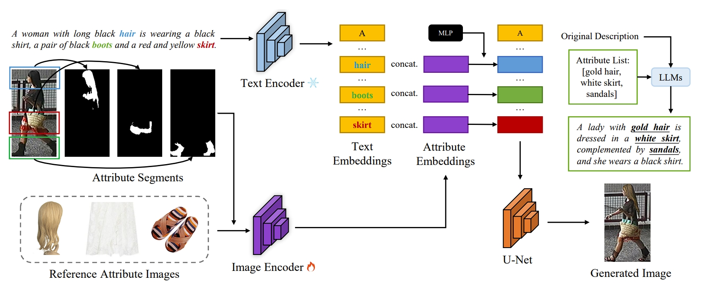

# 2024-AAAI-DP
This is the pytorch implementation of the paper (accpted by AAAI 2024).



## Abstract
Text-based person search is a challenging task aimed at locating specific target pedestrians through text descriptions. Recent advancements have been made in this field, but there remains a deficiency in datasets tailored for text-based person search. The creation of new, real-world datasets is hindered by concerns such as the risk of pedestrian privacy leakage and the substantial costs of annotation. In this paper, we introduce a framework, named Diverse Person (DP), to achieve efficient and high-quality text-based person search data generation without involving privacy concerns. Specifically, we propose to leverage available images of clothing and accessories as reference attribute images to edit the original dataset images through diffusion models. Additionally, we employ a Large Language Model (LLM) to produce annotations that are both high in quality and stylistically consistent with those found in real-world datasets. Extensive experimental results demonstrate that the baseline models trained with our DP can achieve new state-of-the-art results on three public datasets, with performance improvements up to 4.82%, 2.15%, and 2.28% on CUHK-PEDES, ICFG-PEDES, and RSTPReid in terms of Rank-1 accuracy, respectively.

## Usage
### Setup
```
conda create -n diverseperson python
conda activate diverseperson
pip install -r requirements.txt
```
### Training
```
CUDA_VISIBLE_DEVICES=0,1 accelerate launch \
  --mixed_precision=bf16 \
  train.py \
  --pretrained_model_hf runwayml/stable-diffusion-v1-5 \
  --dataset_name {DATASET_PATH} \
  --logging_dir {LOG_PATH} \
  --output_dir {OUTPUT_PATH} \
  --max_train_steps 30000 \
  --num_train_epochs 30000 \
  --train_batch_size 32 \
  --lr 1e-5 \
  --unet_lr_scale 1.0 \
  --checkpointing_steps 200 \
  --mixed_precision bf16 \
  --keep_only_last_checkpoint \
  --keep_interval 10000 \
  --seed 42 \
  --image_encoder_hf openai/clip-vit-large-patch14 \
  --img_token_num 1 \
  --MAX_REFERENCE_ATTRIBUTE_NUM 3 \
  --resolution 128 \
  --text_image_linking control \
  --disable_flashattention \
  --train_image_encoder \
  --image_encoder_trainable_layers 2 \
  --reference_attribute_types hair_uppercloth_bottomcloth \
  --mask_loss \
  --attribute_loc \
  --attribute_loc_weight 1e-3 \
  --attribute_localization_loss balanced_l1 \
  --resume_from_checkpoint latest \
```
### Annotation
```
python annotate.py \
  --origin_path {DATA_PATH} \
  --output_path {ANNOTATION_JSONL_PATH} \
  --model "gpt-3.5-turbo" \
  --TEXT_START 0 \
  --TEXT_END -1 \
  --SLICE_STEP 500 \
```

## Reference
Part of this code is based on related script of [diffusers](https://github.com/huggingface/diffusers).


